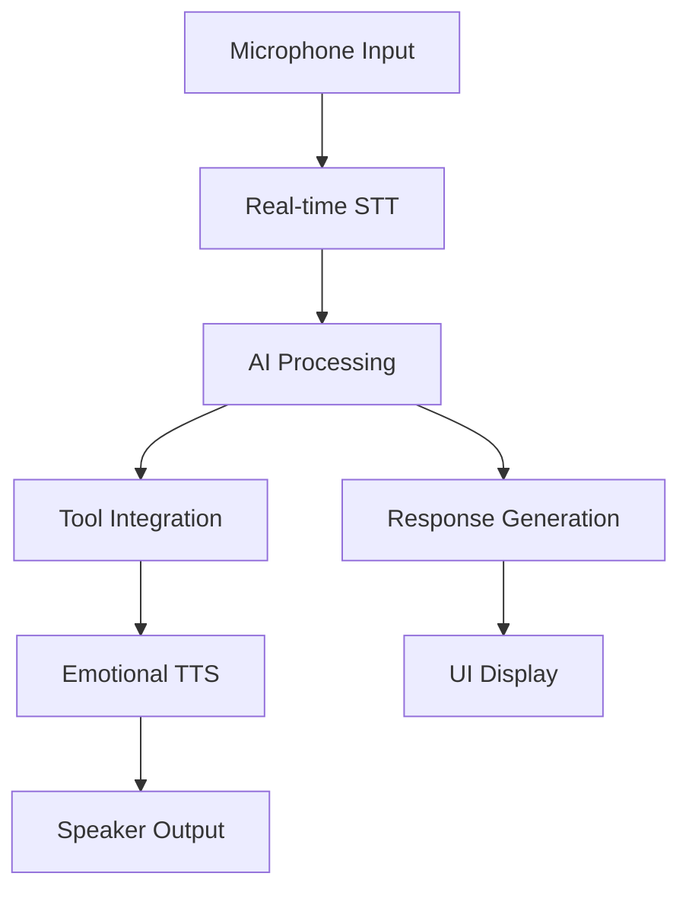

# Sophie AI Assistant 🤖🎙️

[](https://www.python.org/downloads/)
[](https://opensource.org/licenses/MIT)

**Sophie** is a cutting-edge voice assistant combining real-time speech processing, AI reasoning, and emotional response capabilities. Built with privacy-focused design and feminist principles.

<!--  -->

## Features 🌟

- 🎙️ Real-time speech-to-text transcription
- 🧠 GPT-4 powered contextual understanding
- 🎭 Emotion-aware responses (15+ emotional tones)
- 📅 Integrated productivity tools:
  - Calendar management
  - Contact management
  - Email composition
  - Web search
- 🔒 Local processing for sensitive operations
- 📊 Visual audio waveform display

## Installation 💻

1. **Clone repository**:
```bash
git clone https://github.com/Jaweria-B/sophie.git
cd sophie
```

2. **Create & activate a virtual environment**:
```
bash
python -m venv venv
source venv/bin/activate  # macOS/Linux
venv\Scripts\activate   # Windows
```

2. **Install requirements**:
```bash
pip install -r requirements.txt
```

3. **Set environment variables**:
- Create a `.env` in project root:
```
OPENAI_API_KEY=your_openai_api_key
<other variables as needed>
```

5. **Configure GCP**:
- Place your service account JSON in `config/service_account.json`.


## Usage 🚀

```bash
python main.py
```

**Basic Controls:**
- 🟢 Start Recording: Begin voice interaction
- 🔴 Stop Recording: Process request
- 📊 Visual Feedback: Real-time audio waveform
- 🎧 Headphones Recommended: For best TTS experience

## Architecture 📐



## Contributing 🤝

We welcome contributions! Please follow our guidelines:
1. Fork the repository
2. Create feature branch (`git checkout -b feature/amazing-feature`)
3. Commit changes (`git commit -m 'Add amazing feature'`)
4. Push to branch (`git push origin feature/amazing-feature`)
5. Open Pull Request

## License 📄

This project is licensed under the MIT License - see the [LICENSE](LICENSE) file for details.

## Acknowledgements 🙏

- OpenAI for advanced language models
- Python community for audio processing libraries
- Feminist AI Ethics Collective for guidance
